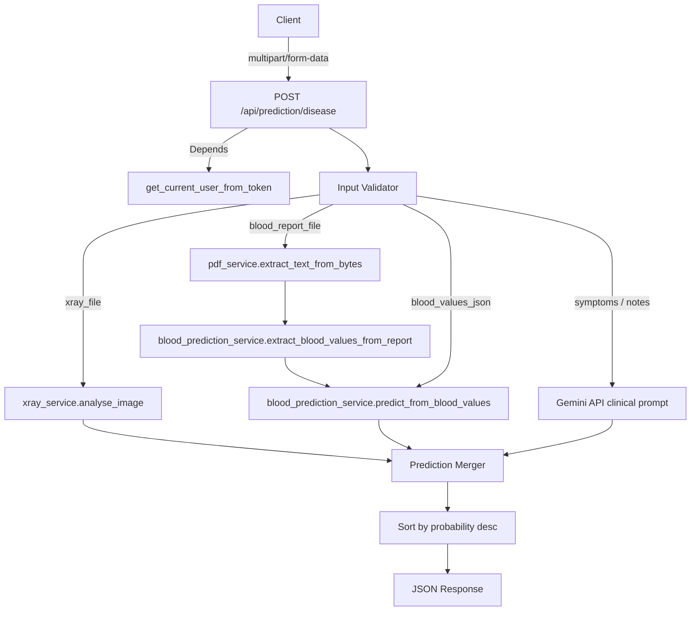

# Design Document: Disease Prediction API

## Overview

The Disease Prediction API adds a single `POST /api/prediction/disease` endpoint to the MedVision AI FastAPI backend. It accepts multipart form data containing any combination of clinical inputs, fans out to the appropriate existing services in parallel where possible, merges and deduplicates the resulting predictions, and returns a ranked JSON response. The endpoint is protected by the existing JWT dependency pattern used throughout the codebase.

---

## Architecture



The router module (`prediction.py`) is the only new file. All service calls use existing modules; no new services are introduced.

---

## Components and Interfaces

### Router: `backend/app/routers/prediction.py`

**Authentication dependency** — identical pattern to `settings.py` and other routers:

```python
from ..services.auth_service import get_current_user_from_token

@router.post("/disease")
async def predict_disease(
    ...,
    current_user: dict = Depends(get_current_user_from_token)
):
```

**Endpoint signature:**

```python
@router.post("/disease")
async def predict_disease(
    xray_file: Optional[UploadFile] = File(None),
    blood_report_file: Optional[UploadFile] = File(None),
    blood_values_json: Optional[str] = Form(None),
    patient_age: Optional[int] = Form(None),
    patient_symptoms: Optional[str] = Form(None),
    doctor_notes: Optional[str] = Form(None),
    current_user: dict = Depends(get_current_user_from_token),
) -> PredictionResponse:
```

### Pydantic Models

```python
class PredictionItem(BaseModel):
    disease: str
    probability: float
    evidence: str
    sources: List[str]
    recommended_tests: List[str]

class PredictionResponse(BaseModel):
    status: str          # "success" | "partial"
    predictions: List[PredictionItem]
    evidence_summary: str
    disclaimer: str
```

### Internal Helper: `_merge_predictions`

```python
def _merge_predictions(raw: List[dict]) -> List[PredictionItem]:
    """
    Deduplicate by disease name (case-insensitive).
    For duplicates: keep max probability, union recommended_tests,
    concatenate evidence, collect all sources.
    Return sorted by probability descending.
    """
```

### Internal Helper: `_call_gemini_symptom_assessment`

```python
async def _call_gemini_symptom_assessment(
    symptoms: Optional[str],
    notes: Optional[str],
    age: Optional[int],
    api_key: str,
) -> List[dict]:
    """
    Build a structured clinical prompt and call the Gemini API.
    Parse the response into a list of prediction dicts with source="symptom".
    Returns [] on failure.
    """
```

---

## Data Models

### Input (multipart/form-data)

| Field | Type | Required | Validation |
|---|---|---|---|
| `xray_file` | UploadFile | No | content_type in `{image/jpeg, image/png}` |
| `blood_report_file` | UploadFile | No | content_type == `application/pdf` |
| `blood_values_json` | str | No | valid JSON string |
| `patient_age` | int | No | 0 ≤ age ≤ 130 |
| `patient_symptoms` | str | No | — |
| `doctor_notes` | str | No | — |

At least one of the five clinical fields must be non-null.

### Internal Prediction Dict (pre-merge)

```python
{
    "disease": str,
    "probability": float,   # 0.0 – 1.0
    "evidence": str,
    "source": str,          # "xray" | "blood_ml" | "blood_rule" | "symptom"
    "recommended_tests": List[str],
}
```

### Response JSON

```json
{
  "status": "success",
  "predictions": [
    {
      "disease": "Pneumonia",
      "probability": 0.87,
      "evidence": "X-ray opacity in lower lobe; elevated WBC",
      "sources": ["xray", "blood_ml"],
      "recommended_tests": ["Chest CT", "Sputum culture"]
    }
  ],
  "evidence_summary": "Analysis based on: chest X-ray, blood report PDF.",
  "disclaimer": "These predictions are AI-assisted and must be reviewed by a qualified physician."
}
```

---

## Correctness Properties

*A property is a characteristic or behavior that should hold true across all valid executions of a system — essentially, a formal statement about what the system should do. Properties serve as the bridge between human-readable specifications and machine-verifiable correctness guarantees.*

### Property 1: No-input rejection

*For any* request where all five clinical input fields are absent, the endpoint must return HTTP 422.

**Validates: Requirements 2.1**

---

### Property 2: Deduplication by disease name

*For any* list of raw prediction dicts that contains two or more entries with the same disease name (case-insensitive), the merged output must contain exactly one entry for that disease name.

**Validates: Requirements 7.1**

---

### Property 3: Max probability preserved after merge

*For any* set of raw predictions sharing the same disease name, the merged prediction's probability must equal the maximum probability among all those raw predictions.

**Validates: Requirements 7.2**

---

### Property 4: Recommended tests union after merge

*For any* set of raw predictions sharing the same disease name, the merged prediction's `recommended_tests` list must contain every test that appeared in any of the individual predictions, with no duplicates.

**Validates: Requirements 7.3**

---

### Property 5: Sources completeness after merge

*For any* set of raw predictions sharing the same disease name, the merged prediction's `sources` list must contain every source label that appeared in any of the individual predictions.

**Validates: Requirements 7.5**

---

### Property 6: Predictions sorted descending by probability

*For any* merged predictions list, for every adjacent pair `(predictions[i], predictions[i+1])`, `predictions[i].probability >= predictions[i+1].probability`.

**Validates: Requirements 7.6**

---

### Property 7: Service failure isolation

*For any* request where a subset of service calls raise exceptions and at least one succeeds, the response must still contain predictions from the successful services and must not raise an unhandled exception.

**Validates: Requirements 9.1**

---

### Property 8: Disclaimer always present

*For any* valid request (regardless of which inputs are provided or which services succeed), the response must include the exact disclaimer string.

**Validates: Requirements 8.4**

---

## Error Handling

| Scenario | Behaviour |
|---|---|
| Missing `Authorization` header | FastAPI raises HTTP 401 via `get_current_user_from_token` |
| Invalid / expired JWT | HTTP 401 via `get_current_user_from_token` |
| No clinical inputs provided | HTTP 422 with message `"At least one clinical input must be provided"` |
| Invalid `blood_values_json` | HTTP 422 with message `"blood_values_json is not valid JSON"` |
| Unsupported file content type | HTTP 422 with descriptive message |
| `patient_age` out of range | HTTP 422 with message `"patient_age must be between 0 and 130"` |
| Individual service raises exception | Log the error, set that source's result to `[]`, continue |
| All services fail | Return HTTP 200 with `status: "partial"`, empty predictions, failure summary in `evidence_summary` |
| Unhandled exception | HTTP 500 with `"An unexpected error occurred"` — no stack trace exposed |

---

## Testing Strategy

### Unit Tests

Focus on specific examples, edge cases, and error conditions:

- `_merge_predictions` with an empty list → returns `[]`
- `_merge_predictions` with a single prediction → returns it unchanged
- `_merge_predictions` with two predictions for the same disease (different case) → one merged entry
- `_merge_predictions` with two predictions for different diseases → two entries sorted correctly
- Input validation: all-None inputs → HTTP 422
- Input validation: invalid JSON in `blood_values_json` → HTTP 422
- Input validation: wrong file content type → HTTP 422
- Input validation: `patient_age` = -1 and 131 → HTTP 422
- Auth: missing header → HTTP 401
- Auth: bad token → HTTP 401

### Property-Based Tests

Use `hypothesis` (Python property-based testing library). Each test runs a minimum of 100 iterations.

Each property test is tagged with a comment in the format:
`# Feature: disease-prediction-api, Property N: <property_text>`

| Property | Test description |
|---|---|
| Property 2 | Generate arbitrary lists of prediction dicts with random disease names (including duplicates); assert merged output has no duplicate disease names |
| Property 3 | Generate groups of predictions sharing a disease name with random probabilities; assert merged probability equals `max()` of the group |
| Property 4 | Generate groups of predictions sharing a disease name with random `recommended_tests` lists; assert merged tests equal the set-union |
| Property 5 | Generate groups of predictions sharing a disease name with random source labels; assert merged sources contain all input sources |
| Property 6 | Generate arbitrary lists of prediction dicts; assert merged output is sorted by probability descending |
| Property 7 | Simulate service failures by injecting exceptions into mock services; assert response is returned without raising |
| Property 8 | Generate arbitrary valid inputs; assert every response contains the disclaimer string |

Properties 2–6 test the pure `_merge_predictions` function directly (no HTTP layer needed), making them fast and deterministic.
